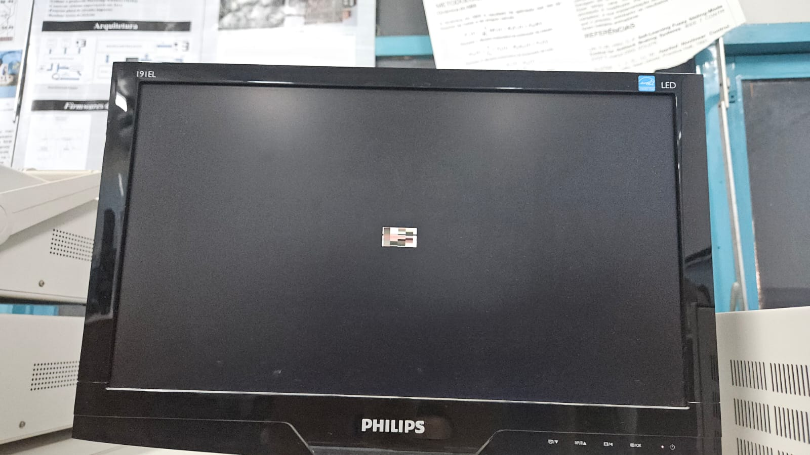

# Zoom Digital: Redimensionamento de Imagens com FPGA em Verilog

## 1. Visão Geral do Projeto

Este projeto foi desenvolvido como parte da avaliação da disciplina de Sistemas Digitais (TEC499) do curso de Engenharia de Computação da Universidade Estadual de Feira de Santana (UEFS). O objetivo principal é criar um coprocessador na FPGA (DE1-SoC) para realizar o redimensionamento de imagens em tempo real, aplicando efeitos de zoom in e zoom out.

Na primeira etapa, o sistema funciona de forma autônoma na FPGA, com controle via chaves e botões, e a exibição da imagem processada em um monitor VGA.

## 2. Requisitos do Projeto

A seguir estão os requisitos funcionais e não funcionais a serem desenvolvidos o durante este projeto.

### 2.1. Requisitos Funcionais

* **RF01:** O sistema deve implementar algoritmos de zoom in (aproximação) e zoom out (redução) em imagens.
* **RF02:** As operações de redimensionamento devem ser em passos de 2X.
* **RF03:** O algoritmo de **Vizinho Mais Próximo** (*Nearest Neighbor*) deve ser implementado para a aproximação.
* **RF04:** O algoritmo de **Replicação de Pixel** deve ser implementado para a aproximação.
* **RF05:** O algoritmo de **Decimação/Amostragem** deve ser implementado para a redução.
* **RF06:** O algoritmo de **Média de Blocos** deve ser implementado para a redução.

* **RF07:** A seleção da operação (zoom in/out) deve ser controlada por chaves e/ou botões da placa.
* **RF08:** A imagem processada deve ser exibida em um monitor através da saída VGA.

### 2.2. Requisitos Não Funcionais

* **RNF01:** O código deve ser desenvolvido exclusivamente em linguagem **Verilog**.
* **RNF02:** O projeto deve utilizar apenas os componentes disponíveis na placa de desenvolvimento **DE1-SoC**.
* **RNF03:** As imagens devem ser representadas em escala de cinza, com cada pixel codificado por um inteiro de 8 bits.
* **RNF04:** O coprocessador deve ser projetado para ser compatível com o Hard Processor System (HPS) ARM, visando futuras integrações.
* **RNF05:** Toda a documentação do projeto, códigos e informações de suporte devem estar disponíveis no arquivo `README.md` em um repositório GitHub.
* **RNF06:** Os códigos-fonte devem ser detalhadamente comentados.

## 3. Ambiente de Desenvolvimento

### 3.1. Software Utilizado

| Software | Versão | Descrição |
| :--- | :--- | :--- |
| Quartus Prime | 13.1.0 | Ferramenta de desenvolvimento para FPGAs Intel. |

### 3.2. Hardware Utilizado

| Componente | Especificação |
| :--- | :--- |
| Kit de Desenvolvimento | Terasic DE1-SoC |
| Monitor | Monitor com entrada VGA. |
| Computador | Para compilação do projeto |

## 4. Instalação e Configuração

1.  **Clonar o Repositório:**
    ```bash
    git clone <https://github.com/LucasBrito10/Coprocessador>
    cd <NOME_DO_SEU_REPOSITORIO>
    ```
2.  **Configuração do Quartus Prime:**    
    * Abra o Quartus Prime.
    * Abra o arquivo de projeto `.qpf`.    
3.  **Compilação:**
    * Com o Quartus aberto, clique no botão de Start Compilation.

        
    
    para gerar o arquivo de programação (`.sof`).
    * Ainda no Quartus, vá em Programmer 
4.  **Programação da FPGA:**
    * Conecte a placa DE1-SoC ao computador.
    * Abra o "Programmer" no Quartus Prime. 

        
    * Selecione o arquivo `.sof` gerado e programe a placa.
    * Clique em "Start" e as instruções serão repassadas a placa.

## 5. Manual do Usuário
Após realizar as etapas de instalação e configuração a FPGA estará pronta para ser utilizada da seguinte forma (Segue imagem retirada do manual da placa para servir com referência):


| Chave | Nível Lógico | Ação                                                                                                                   |
| :---- | :------------- | :--------------------------------------------------------------------------------------------------------------------- |
| SW9   | Baixo          | Selecionar Zoom Out                                                                                                    |
| SW9   | Alto           | Selecionar Zoom In                                                                                                     |
| SW8   | Baixo          | Se SW9 = 0, Selecionar Algoritmo Zoom Out Decimação. Se SW9 = 1, Seleciona Algoritmo Zoom In Vizinho Mais Próximo.       |
| SW8   | Alto           | Se SW9 = 0, Selecionar Algoritmo Zoom Out Média de Blocos. Se SW9 = 1, Seleciona Algoritmo Zoom In Replicação de Pixel. |
| SW7   | Baixo          | -                                                                                                                      |
| SW7   | Alto           | Se SW9 = 0, Seleciona Zoom Out 2x. Se SW9 = 1, Seleciona Zoom In 2x.                                                     |
| SW6   | Baixo          | -                                                                                                                      |
| SW6   | Alto           | Se SW9 = 0, Seleciona Zoom Out 4x. Se SW9 = 1, Seleciona Zoom In 4x.                                                     |
| SW5   | Baixo          | -                                                                                                                      |
| SW5   | Alto           | Se SW9 = 0, Seleciona Zoom Out 8x. Se SW9 = 1, Seleciona Zoom In 8x.                                                     |
| OBS   | | Se mais uma opção de Zoom estiver selecionada, valerá a chave de maior zoom (SW5)


## 6. Descrição da Solução
Abaixo consta a descrição de cada modulo criado para a solução do projeto.

### 6.1. Módulo de Memória de Imagem
O módulo de memória (memory.v) é responsável por armazenar a imagem de entrada (fornecida em binário) e fornecer os dados de pixel correspondentes a cada coordenada de tela solicitada.

Principais características e lógica de funcionamento:

Inicialização: O bloco initial é usado para carregar a imagem de entrada na memória image_data a partir de um arquivo de texto binário (image.txt). A instrução $readmemb lê o conteúdo do arquivo linha por linha, onde cada linha deve representar um byte de dados de pixel.

Endereçamento de Pixels: O módulo calcula o endereço de memória (addr) para cada pixel com base nas coordenadas de imagem x_img e y_img. A fórmula usada é addr = y_img * IMG_WIDTH + x_img.

Lógica de Saída: Um bloco always síncrono, disparado pelo clock e pelo reset, controla a saída de pixel. Quando o sinal flow_enabled está ativo e as coordenadas x_img e y_img estão dentro dos limites da imagem, o módulo acessa a memória no endereço calculado e coloca o valor do pixel na saída pixel_out. O sinal pixel_out_valid é então ativado para indicar que os dados do pixel são válidos e podem ser lidos por outros módulos. Caso contrário, a saída é zerada e pixel_out_valid é desativado.

### 6.3. Módulos de Redimensionamento

#### 6.3.1. Zoom In (Aproximação)
* **Vizinho Mais Próximo:** 

    Entradas: O módulo recebe as coordenadas do pixel da tela VGA (x_vga, y_vga), um sinal de controle flow_enabled e um fator de zoom k.

    Lógica de Cálculo: A lógica do Vizinho Mais Próximo para o zoom in é implementada com um deslocamento de bits (shift right) nas coordenadas VGA. O cálculo de x_img <= x_vga >> k e y_img <= y_vga >> k é uma operação que faz a divisão das coordenadas da tela por 2^k. Ela determina qual pixel da imagem original corresponde ao pixel atual da tela.

    Saídas: O módulo gera as coordenadas x_img e y_img, que são utilizadas pelo módulo de memória para a busca dos dados do pixel correspondente. O sinal de controle valid é ativado quando as coordenadas de saída são válidas.

* **Replicação de Pixel:** 

    Entradas: O módulo recebe as coordenadas do pixel da tela VGA (x_vga, y_vga), um sinal de habilitação de fluxo (flow_enabled), um seletor de algoritmo (algorithm_select) e um fator de zoom (k).

    Lógica de Cálculo: A lógica da Replicação de Pixel para o zoom in é implementada através de uma divisão inteira. Primeiramente, um zoom_factor é calculado fazendo um deslocamento de bits em k (1 << k), que equivale a 2^k. Em seguida, as coordenadas da imagem são calculadas dividindo-se as coordenadas VGA pelo zoom_factor (x_img <= x_vga / zoom_factor e y_img <= y_vga / zoom_factor). Essa operação mapeia um bloco de pixels da tela para um único pixel da imagem original, replicando-o para preencher a área ampliada.

    Saídas: O módulo gera as coordenadas x_img e y_img, que são usadas pelo módulo de memória para buscar os dados do pixel correspondente. O sinal de controle valid é ativado quando as coordenadas de saída são válidas.

#### 6.3.2. Zoom Out (Redução)
* **Decimação/Amostragem:** 

    Tem como objetivo reduzir o tamanho da imagem de entrada.

    Entradas: O módulo recebe as coordenadas do pixel da tela VGA, x_vga e y_vga, e um fator de zoom de redução, k.

    Lógica de Cálculo: Para cada pixel na tela de saída, o módulo calcula qual pixel da imagem original ele representa. O fator de zoom k é usado como um valor de deslocamento de bits (shift left). A expressão x_img <= x_vga << k e y_img <= y_vga << k multiplica as coordenadas de saída por 2^k.

    Decimação: O algoritmo "decima" (descarta) a maioria dos pixels da imagem original. Para criar um pixel na imagem reduzida, ele seleciona um pixel da imagem original. Por exemplo, com um zoom out de 2x (k=1), o pixel de saída no canto superior esquerdo (0,0) corresponderá ao pixel (0,0) da imagem original. Para o pixel (1,0) da saída, ele lerá o pixel (2,0) da imagem original, ignorando o pixel (1,0). O resultado é uma imagem reduzida.

* **Média de Blocos:** 

    Entradas: O módulo recebe as coordenadas do pixel da tela VGA (x_vga, y_vga), um sinal de habilitação de fluxo (flow_enabled), um seletor de algoritmo (algorithm_select), um fator de zoom (k) e o pixel de entrada da memória (mem_pixel_in).

    Lógica de Cálculo: A lógica da Média de Blocos é controlada por uma máquina de estados finitos (FSM) que é ativada quando o algorithm_select está em nível alto e k é maior que zero. Primeiramente, as coordenadas base (base_x, base_y) do bloco na imagem original são calculadas multiplicando as coordenadas da tela por 2^k (x_vga << k). A FSM então varre uma área (bloco) de pixels da imagem original, acumula a soma dos valores desses pixels em um registrador (sum) e, ao final, calcula a média. Uma otimização foi implementada: para zoom de 4x e 8x, apenas uma sub-região central do bloco é somada para determinar o pixel final. A média é calculada por meio de uma operação de deslocamento de bits para a direita (>>), que é uma forma eficiente de realizar a divisão em hardware.

    Saídas: O módulo gera os endereços mem_x_addr e mem_y_addr para ler o bloco de pixels da memória. Após o cálculo da média, o resultado é disponibilizado na saída pixel_out, e o sinal pixel_valid é ativado para indicar que o dado é válido.

### 6.4. Módulo de Controle VGA

O módulo vga_controller é o componente central para a comunicação com o monitor VGA. Sua principal função é gerar os sinais de sincronismo horizontal (hsync), sincronismo vertical (vsync) e os sinais de temporização que controlam a varredura da tela.

O módulo é configurado para a resolução padrão VGA de 640x480 pixels com um clock de 25 MHz. Ele opera através de contadores síncronos:

x_vga: Contador horizontal, que avança a cada ciclo de clock, de 0 até H_TOTAL - 1 (800).

y_vga: Contador vertical, que avança apenas quando o contador horizontal completa um ciclo, de 0 até V_TOTAL - 1 (525).

A partir desses contadores, o módulo gera os sinais críticos de temporização:

hsync (Sincronismo Horizontal): Um pulso ativo baixo é gerado quando o contador x_vga está na região de sincronismo horizontal (entre 656 e 752).

vsync (Sincronismo Vertical): Um pulso ativo baixo é gerado quando o contador y_vga está na região de sincronismo vertical (entre 490 e 492).

flow_enabled: Este sinal indica a área visível da tela (640x480 pixels). Ele é ativo quando as coordenadas dos contadores x_vga e y_vga estão dentro dos limites visíveis da imagem. A lógica do projeto high_level utiliza esse sinal para determinar quando enviar dados de pixel para o monitor, garantindo que apenas a imagem processada seja exibida na tela e não os sinais de retorno e temporização.

## 7. Testes e Validação
Foram realizados testes de mesa diretamente na FPGA comparando o comportamento do redimensionamento da imagem por cada algoritmo após utilização de cada chave seletora

### 7.1. Teste de Zoom In

**Imagem Original vs. Vizinho Mais Próximo vs. Replicação de Pixel**

| Original | Vizinho Mais Próximo (2X) | Replicação de Pixel (2X) |
| :--- | :--- | :--- |
|  |  | *(img)* |

| Original | Vizinho Mais Próximo (4X) | Replicação de Pixel (4X) |
| :--- | :--- | :--- |
| |  | *(img)* |

| Original | Vizinho Mais Próximo (8X) | Replicação de Pixel (8X) |
| :--- | :--- | :--- |
|  |  | *(img)* |

### 7.2. Teste de Zoom Out

*Demonstre a aplicação do zoom out. Compare o resultado dos dois algoritmos implementados.*

**Imagem Original vs. Decimação vs. Média de Blocos**

| Original | Decimação (2X) | Média de Blocos (2X) |
| :--- | :--- | :--- |
|  | |  |

| Original | Decimação (4X) | Média de Blocos (4X) |
| :--- | :--- | :--- |
|  | |   |

| Original | Decimação (8X) | Média de Blocos (8X) |
| :--- | :--- | :--- |
|  |  |  |

## 8. Análise dos Resultados

* **Comparativo Visual:** Zoom In: Ambos algoritmos não apresentaram diferenças visiveis tanto na imagem original quanto na imagem original amplificada.
Zoom Out: O algoritmo de Decimação realiza de forma totalmente funcional a redução da imagem em todas opções de Zoom Out, porem, como demonstrado na tabela de imagens anteriores, a média de bloco não está totalmente funcional, dificultando assim uma comparação justa entre ambos os algoritmos.

* **Limitações:** Zoom Out não totalmente funcional no algoritmo Média de Blocos

* **Itens Não Atendidos:** Média de Blocos 2x, 4x e 8x. Ao acionar a chave seletora do Algoritmo de Média de blocos, a imagem se mantem nitida, porêm, ao selecionar o Zoom Out de 2x, a imagem se apresenta "pixelada" e perde um pouco da sua qualidade. Ao acionar o Zoom Out de 4x, a imagem perde totalmente sua qualidade ficando não identificavel a imagem original. Ao acionar o Zoom Out 8x apenas é mostrada um uma figura geométrica retangular escura na tela, após uma analise detalhada, foi constatado que o motivo do erro se dá...


